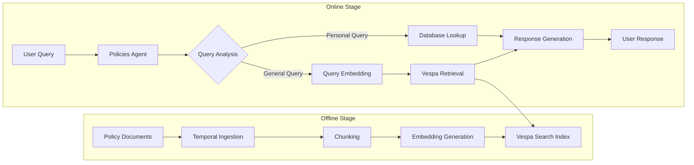

# Agentic RAG Architecture

## Overview

This document describes the Retrieval-Augmented Generation (RAG) system that
powers the Policies Agent. The system combines **offline document ingestion**
with **online agentic retrieval** to provide accurate, context-aware responses
about insurance policies.

## Architecture Overview



## Two-Stage Architecture

### 1. Offline Stage: Document Ingestion

[**Full Documentation**: Document Ingestion Pipeline](ingestion-pipeline.md)

- **Temporal-orchestrated** workflow for durability and fault tolerance
- **Document processing**: Loading → Chunking → Embedding → Indexing
- **Storage**: MinIO for document management, Vespa for search
- **Continuous monitoring**: Auto-processes new documents

### 2. Online Stage: Agentic Retrieval

The Policies Agent uses a **ReAct pattern** (Reasoning + Acting) to handle
queries. The LLM autonomously decides which tool to call:

```python
# DSPy ReAct - LLM decides tool usage based on query analysis
# Available tools:
# - get_personal_policy_details(policy_number) → Database lookup
# - search_policy_documentation(query, category) → Vespa search

# Example: "What's my premium for A12345?"
#   → LLM extracts policy_number="A12345"
#   → LLM calls get_personal_policy_details("A12345")

# Example: "What does fire damage cover?"
#   → LLM identifies general query, category="home"
#   → LLM calls search_policy_documentation("fire damage", "home")
```

## Vespa Search Configuration

### Hybrid Search Strategy

Our system uses **hybrid search** combining semantic and keyword matching:

```yaml
Search Weights:
  - Semantic (Vector): 70% # Understanding intent
  - Keyword (BM25): 30% # Exact term matching
```

### Document Schema

[`libraries/integrations/vespa/`](../libraries/integrations/vespa/)

```python
{
    "id": "unique_chunk_id",
    "title": "Policy Document - filename.md",
    "text": "chunk content...",
    "category": "home|auto|health|life",
    "embedding": [384-dim vector],
    "metadata": {
        "page_numbers": [1, 2],
        "chunk_index": 0,
        "source_file": "home.md"
    }
}
```

## Key Components

### Agent Tools

[`agents/policies/agent/tools/`](../agents/policies/agent/tools/)

1. **`get_personal_policy_details`** - Database lookup for personal policy data
2. **`search_policy_documentation`** - Vespa search for general information

### Retrieval Implementation

[`agents/policies/agent/services/`](../agents/policies/agent/services/)

**Embedding Generation** (`embeddings.py`):
- Model: `all-MiniLM-L6-v2` (sentence-transformers)
- Dimensions: 384-dimensional vectors
- Used at both ingestion time (documents) and query time (user queries)

**Search Service** (`search_service.py`):
- Query construction with category filtering
- Hybrid search combining vector similarity and keyword matching
- Result ranking and metadata extraction

### Agent Logic

[`agents/policies/agent/main.py`](../agents/policies/agent/main.py)

- ReAct loop implementation
- Query analysis and tool selection
- Response generation with citations

## Performance & Testing

### Retrieval Performance Test

[**Test Suite**: `test_retrieval_performance.py`](../agents/policies/tests/test_retrieval_performance.py)

Comprehensive 4-stage testing:

1. **Collect** - Query all parameter combinations
2. **Metrics** - Calculate performance statistics
3. **Judge** - LLM evaluation of result quality
4. **Report** - MLflow tracking and analysis

### RAGAS-Style Evaluation

[`agents/policies/tests/retrieval_performance/`](../agents/policies/tests/retrieval_performance/)

Uses [RAGAS](https://docs.ragas.io/)-inspired metrics with custom extensions:

- **LLM Judge**: Answer relevancy, completeness, faithfulness (40% weight)
- **Context Metrics**: Recall, Precision@K, NDCG (20% weight)
- **Retrieval Metrics**: Success rate, speed, hit count (30% weight)
- **Position Metrics**: Best match position, top-3 hit rate (10% weight)

#### Context Metrics Explained

| Metric    | Question it answers                                        |
| --------- | ---------------------------------------------------------- |
| Recall    | Did you find ALL relevant docs? (completeness)             |
| Precision | Of what you returned, how many were relevant? (accuracy)   |
| NDCG      | Are relevant docs ranked at the TOP? (ordering)            |

Results tracked in MLflow for continuous optimization.

## User Flow: Chat UI to RAG

### How Users Access Policy Information

1. **User Opens Chat UI**
   ```
   http://localhost:8000
   ```

2. **User Asks Policy Question**
   ```
   User: "What is the deductible for auto insurance?"
   ```

3. **Frontend Routes to Policies Agent**
   - Triage agent classifies query → routes to Policies Agent
   - Policies Agent analyzes query type

4. **Agent Retrieves Information**
   ```python
   # For general questions → Vespa search
   "What is covered?" → search_policy_documentation()

   # For personal data → Database lookup  
   "My policy A12345" → get_personal_policy_details()
   ```

5. **Response with Citations**
   ```
   Agent: "For auto insurance, the standard deductible is $500 
   for collision coverage and $250 for comprehensive coverage.

   Source: Auto Policy Document, Section 3.5"
   ```

### Quick Start

```bash
# 1. Start everything
make docker-up && make start-all

# 2. Open chat UI
open http://localhost:8000

# 3. Ask policy questions
# Examples:
# - "What's covered under home insurance?"
# - "How do I file a claim?"
# - "What are the life insurance exclusions?"
```

## Configuration

### Hybrid Search Strategy

The Policies Agent uses a sophisticated hybrid search approach:

- **70% Vector Similarity**: Semantic understanding of queries
- **30% BM25 Keyword Matching**: Exact term matching for precision
- **Multiple Ranking Profiles**:
  - `default`: Pure BM25 for keyword search
  - `semantic`: Pure vector similarity
  - `hybrid`: Combined scoring (recommended)
  - `with_position`: Considers chunk position in document

### Tool Selection Logic

```python
# DSPy ReAct pattern determines tool usage:
if policy_number_detected:
    use get_personal_policy_details()
elif needs_documentation:
    use search_policy_documentation() with hybrid search
else:
    provide direct answer from context
```

### Search Parameters

```python
# agents/policies/agent/config.py
hybrid_alpha = 0.7  # 70% semantic, 30% keyword
max_results = 5     # Top K results
min_score = 0.7     # Relevance threshold
```

### Model Settings

```python
# Embedding model for search
embedding_model = "all-MiniLM-L6-v2"  # 384 dimensions
embedding_size = 384

# LLM for response generation
language_model = "gpt-4o-mini"
```

## Related Documentation

- [Document Ingestion Pipeline](ingestion-pipeline.md) - Offline stage details
- [Building Agents Guide](building-agents-eggai.md) - Agent development patterns
- [Vespa Configuration](../agents/policies/vespa/) - Search configuration and
  deployment

---

**Previous:** [Model Flexibility](model-flexibility.md) | **Next:**
[Ingestion Pipeline](ingestion-pipeline.md) | [Back to Index](README.md)
