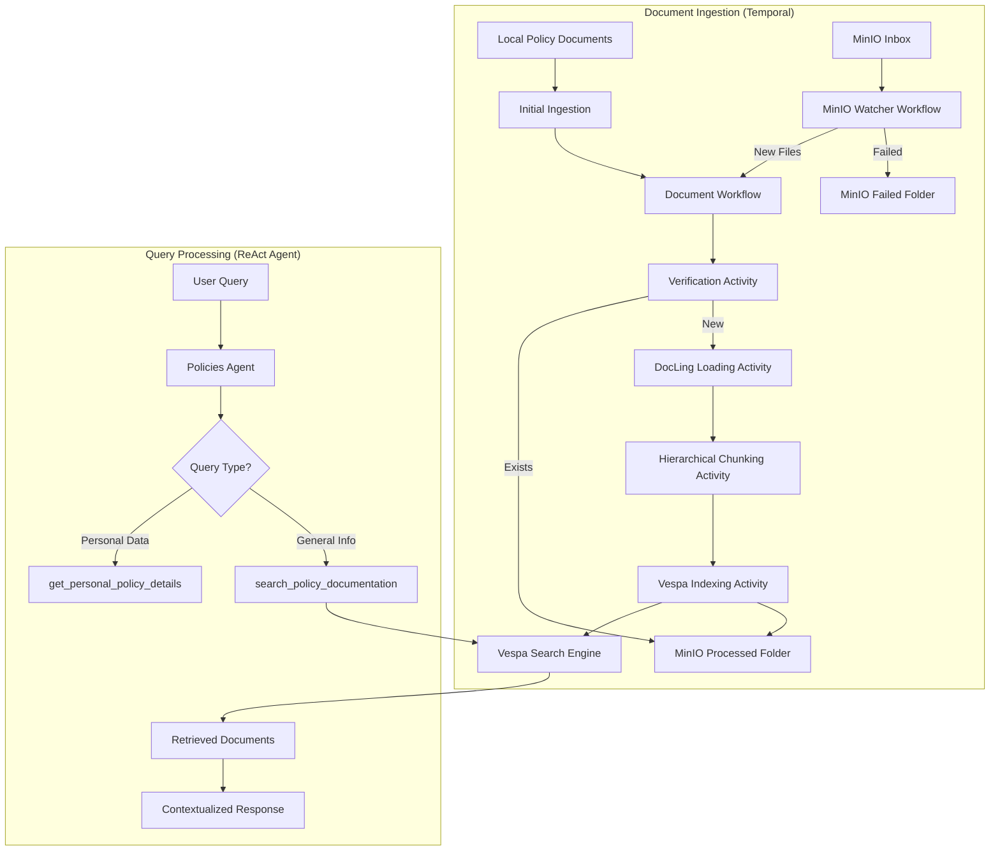

# Document Ingestion Pipeline

This document explains the Temporal-based ingestion pipeline that powers the Policies Agent's RAG (Retrieval-Augmented Generation) system.

## Overview

The ingestion pipeline uses **Temporal workflows** to orchestrate durable, fault-tolerant document processing. The system supports both initial document ingestion and continuous monitoring through MinIO object storage. Documents are parsed, chunked, and indexed into **Vespa** for semantic search.

## Architecture



## Why Temporal?

Document ingestion is a complex multi-step process that requires:

- **Durability**: Resume from failures without losing progress
- **Retries**: Automatic retry with exponential backoff
- **Observability**: Complete audit trail of all processing steps
- **Scalability**: Distribute activities across multiple workers
- **Scheduling**: Continuous monitoring with configurable polling intervals

## Ingestion Pipeline Components

### 1. MinIO Inbox Watcher Workflow
[`agents/policies/ingestion/workflows/minio_watcher_workflow.py`](../agents/policies/ingestion/workflows/minio_watcher_workflow.py)

```python
# Continuous polling workflow (default: 30s interval)
# Monitors MinIO inbox folder for new documents
# Auto-generates document_id from filename if missing
# Triggers DocumentIngestionWorkflow as child workflow
# Handles file movement: inbox → processed/failed
```

### 2. Document Ingestion Workflow (Child)
[`agents/policies/ingestion/workflows/ingestion_workflow.py`](../agents/policies/ingestion/workflows/ingestion_workflow.py)

```python
# Orchestrates the complete document processing pipeline:
# 1. Verify document doesn't already exist
# 2. Load document using DocLing
# 3. Chunk document with metadata extraction
# 4. Generate embeddings and index to Vespa
# Supports both filesystem and MinIO sources
```

### 3. Document Verification
[`agents/policies/ingestion/workflows/activities/document_verification_activity.py`](../agents/policies/ingestion/workflows/activities/document_verification_activity.py)

```python
# Checks both MinIO processed folder and Vespa index
# Prevents duplicate processing
# Supports force_rebuild flag
# SHA256 hash validation
```

### 4. Document Loading (DocLing)
[`agents/policies/ingestion/workflows/activities/document_loading_activity.py`](../agents/policies/ingestion/workflows/activities/document_loading_activity.py)

```python
# Uses DocLing DocumentConverter
# Supports PDF, Markdown, DOCX formats
# Extracts structured content with metadata
# Downloads from MinIO when source="minio"
```

### 5. Hierarchical Chunking
[`agents/policies/ingestion/workflows/activities/document_chunking_activity.py`](../agents/policies/ingestion/workflows/activities/document_chunking_activity.py)

```python
# GPT-2 tokenizer with smart boundaries
# Config: max_tokens=500, min_tokens=100
# Preserves semantic coherence
# 2-sentence overlap between chunks
```

### 6. Vespa Indexing
[`agents/policies/ingestion/workflows/activities/document_indexing_activity.py`](../agents/policies/ingestion/workflows/activities/document_indexing_activity.py)

```python
# Hybrid search with both keyword and semantic understanding:
# - Vector embeddings: 384-dim from all-MiniLM-L6-v2 model
# - BM25 text search for keyword matching
# - Hybrid ranking: 70% vector similarity + 30% keyword relevance
# Schema includes: id, title, text, category, source_file, embedding
# Enhanced metadata: page numbers, headings, chunk relationships
```

## Temporal Workflow Details

### Activity Configuration
```python
# Default retry policy for all activities
retry_policy = RetryPolicy(
    maximum_attempts=3,
    initial_interval=timedelta(seconds=1),
    maximum_interval=timedelta(seconds=10),
    backoff_coefficient=2
)

# Activity timeouts
activity_options = ActivityOptions(
    start_to_close_timeout=timedelta(minutes=5),
    retry_policy=retry_policy
)
```

### Error Handling
- Failed documents are moved to MinIO failed folder
- Activities automatically retry with exponential backoff
- Workflow history preserved for debugging
- Child workflows isolated to prevent cascading failures

## Key Files

### Workflows
- **Main Ingestion Workflow**: [`agents/policies/ingestion/workflows/ingestion_workflow.py`](../agents/policies/ingestion/workflows/ingestion_workflow.py)
- **MinIO Watcher**: [`agents/policies/ingestion/workflows/minio_watcher_workflow.py`](../agents/policies/ingestion/workflows/minio_watcher_workflow.py)
- **Worker Entry Point**: [`agents/policies/ingestion/start_worker.py`](../agents/policies/ingestion/start_worker.py)

### Supporting Files
- **Configuration**: [`agents/policies/ingestion/config.py`](../agents/policies/ingestion/config.py)
- **Vespa Client**: [`libraries/integrations/vespa/vespa_client.py`](../libraries/integrations/vespa/vespa_client.py)

## Running the Ingestion

### Start the Worker

```bash
# Start all services and agents
make start-all

# Or start just the ingestion worker
make start-policies-document-ingestion

# Stop all agents
make kill-agents
```

### Ingestion Process

1. **Initial Ingestion**: Documents in `agents/policies/ingestion/documents/` are automatically ingested on startup:
   - `auto.md` - Auto insurance policies
   - `home.md` - Home insurance policies  
   - `health.md` - Health insurance policies
   - `life.md` - Life insurance policies

2. **Auto-Migration**: After initial indexing, documents are automatically migrated to MinIO processed folder

3. **Continuous Monitoring**: MinIO watcher workflow automatically starts on worker startup and monitors the inbox folder every 30 seconds

### Monitor Progress

- **Temporal UI**: http://localhost:8081
- **Vespa Status**: http://localhost:19071
- **MinIO Console**: http://localhost:9001

## Vespa Search Integration

### Query Format

```python
# Using hybrid search combining semantic and keyword matching
# Embeddings generated on-the-fly for each query
results = retrieve_policies(
    query="fire damage coverage",
    category="home"  # Optional
)
# Behind the scenes:
# 1. Query embedding generated using all-MiniLM-L6-v2
# 2. Hybrid search with alpha=0.7 (70% semantic, 30% keyword)
```

### Result Structure

```json
{
  "content": "The Insurer agrees to indemnify...",
  "score": 0.85,
  "document_id": "home_chunk_4",
  "document_metadata": {
    "category": "home",
    "chunk_index": 4,
    "source_file": "home.md"
  }
}
```

## ReAct Agent Integration

The Policies Agent uses a ReAct (Reasoning + Acting) pattern with two tools:

### Tool 1: Personal Policy Lookup

```python
get_personal_policy_details(policy_number: str)
# Returns specific policy data from database
# Used for: premiums, due dates, personal info
```

### Tool 2: Document Search

```python
search_policy_documentation(query: str, category: str = None)
# Searches Vespa-indexed policy documents
# Used for: coverage questions, general info
```

### Decision Logic

The agent analyzes queries to determine:

- **Personal queries**: Require policy number (e.g., "What's my premium for A12345?")
- **General queries**: Search documentation (e.g., "What does fire damage cover?")

## Configuration

### Temporal Settings

```yaml
# agents/policies/ingestion/config.py
temporal_server_url: "localhost:7233"
temporal_namespace: "default"
temporal_task_queue: "policy-rag"
```

### MinIO Settings

```yaml
# Environment variables
MINIO_ENDPOINT_URL: "http://localhost:9000"
MINIO_ACCESS_KEY: "user"
MINIO_SECRET_KEY: "password"
MINIO_POLL_INTERVAL: "30"  # seconds
```

### Vespa Configuration

```yaml
# Chunking parameters
max_tokens: 500
min_tokens: 100
overlap_sentences: 2

# Search settings
vespa_url: "http://localhost:8080"
schema_name: "policy_document"
```

## Adding New Documents

### Method 1: Direct Upload to MinIO
1. Upload file to MinIO inbox folder via:
   - MinIO Console (http://localhost:9001)
   - AWS CLI: `aws s3 cp file.md s3://documents/inbox/`
2. Watcher workflow automatically detects and processes the file
3. File is moved to processed/ or failed/ folder based on result

### Method 2: Add to Source Code
1. Add markdown file to `agents/policies/ingestion/documents/`
2. Update category enum if needed
3. Restart the ingestion worker
4. Documents will be automatically processed and migrated to MinIO

## Search Capabilities

### Currently Active
- **Hybrid Search**: Combines semantic understanding with keyword matching
  - 70% weight on vector similarity (semantic understanding)
  - 30% weight on BM25 keyword matching
  - Provides best of both worlds: understanding intent AND exact term matching
- **Vector Embeddings**: 384-dimensional embeddings using all-MiniLM-L6-v2
- **Category Filtering**: Filter results by policy type (auto, home, health, life)
- **Metadata Enrichment**: Page numbers, headings, chunk relationships

### How It Works
1. User query is embedded using the same model used during indexing
2. Vespa performs nearest neighbor search in vector space
3. Results are ranked using hybrid scoring (0.7 × vector_similarity + 0.3 × keyword_relevance)
4. Top results returned with metadata and citations

### Benefits of Hybrid Search
- **Semantic Understanding**: Finds relevant content even with different wording
- **Keyword Precision**: Still matches exact terms when needed
- **Better Recall**: Catches both conceptually similar and literally matching documents
- **Balanced Relevance**: Avoids pure semantic drift while maintaining understanding

---

**Previous:** [Building Agents Guide](building-agents-eggai.md) | **Next:** [RAG with Vespa](agentic-rag.md)