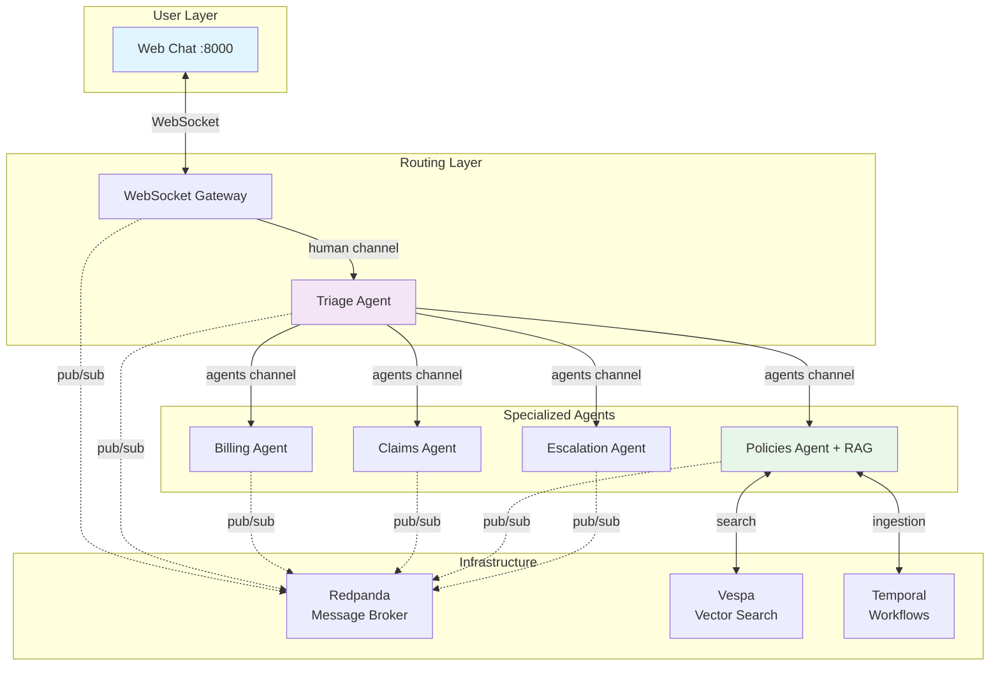

# Multi-Agent System Architecture

## Overview

A distributed insurance support system where specialized AI agents collaborate via event-driven messaging to handle user inquiries.

## Architecture Diagram



## Core Components

### Message Channels

| Channel | Purpose | Publishers | Subscribers |
|---------|---------|------------|-------------|
| `human` | User messages | Frontend | Triage, Audit |
| `human_stream` | Agent responses | All agents | Frontend |
| `agents` | Routed requests | Triage | Specialized agents |
| `audit_logs` | Compliance | Audit | Monitoring systems |

### Agent Roles

**Triage Agent**
- Classifies user intent using ML models
- Routes to appropriate specialist
- Handles greetings directly

**Specialized Agents**
- **Billing**: Premium amounts, payment dates, billing updates
- **Claims**: File claims, check status, update information
- **Policies**: Document search via RAG, coverage questions
- **Escalation**: Complaints, complex issues, ticket creation

**Audit Agent**
- Monitors all channels
- Creates compliance logs

## Message Flow

```
1. User sends message via WebSocket
2. Triage classifies intent
3. Routes to specialized agent
4. Agent processes and responds
5. Response streams back to user
6. Audit logs all interactions
```

## Key Design Patterns

### Event-Driven Communication
- Asynchronous message passing via Redpanda
- No direct agent-to-agent calls
- Enables independent scaling

### Stateless Agents
- No shared state between instances
- All context in messages
- Horizontal scaling ready

### RAG Integration
- Policies agent uses Vespa for semantic search
- Temporal orchestrates document ingestion
- Hybrid search (keyword + vector)

## Platform Services

| Service | Purpose | Port |
|---------|---------|------|
| Redpanda | Kafka-compatible message broker | 19092 |
| Vespa | Vector search for documents | 8080 |
| Temporal | Durable workflow orchestration | 7233 |
| PostgreSQL | Temporal/MLflow storage | 5432 |
| Grafana | Metrics visualization | 3000 |
| Prometheus | Metrics collection | 9090 |

## Deployment Architecture

```
┌─────────────┐     ┌─────────────┐     ┌─────────────┐
│   Agent 1   │     │   Agent 2   │     │   Agent N   │
│  Container  │     │  Container  │     │  Container  │
└──────┬──────┘     └──────┬──────┘     └──────┬──────┘
       │                   │                   │
       └───────────────────┴───────────────────┘
                           │
                    ┌──────▼──────┐
                    │  Redpanda   │
                    │   Cluster   │
                    └─────────────┘
```

Each agent:
- Runs as independent container
- Scales horizontally
- Connects to shared infrastructure

---

**Next:** [Agent Capabilities Overview](agents-overview.md)